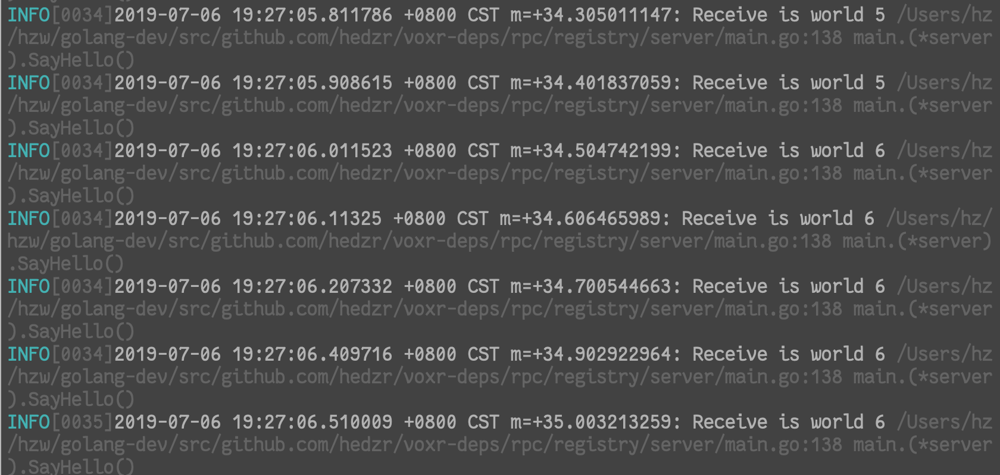

# logex


<!-- ](https://travis-ci.org/hedzr/logex) -->
[](https://github.com/hedzr/logex/releases)
[](https://sourcegraph.com/github.com/hedzr/logex?badge)

an enhanced for [logrus](https://github.com/sirupsen/logrus). `logex` append the context call info to the log.

Since v1.2.0, `logex` allows switching the logging backend transparently.

> v1.2.0 is a pre-release version.





## Usage

```go
import "github.com/hedzr/logex"

func init(){
	  logex.Enable()
    // Or:
    logex.EnableWith(logrus.DebugLevel)
}
```


### ignore the extra caller frames

If you are writing logging func wrappers, you might ignore the extra caller frames for those wrappers:

```go
func wrong(err error, fmt string, args interface{}) {
    logrus.WithError(err).WithFields(logrus.Fields{
        logex.SKIP: 1,  // ignore wrong() frame
    }).Errorf(fmt, args)
}

func wrongInner(err error, fields logrus.Fields, fmt string, args interface{}) {
    logrus.WithError(err).WithFields(fields).Errorf(fmt, args)
}

func wrongwrong(err error, fmt string, args interface{}) {
    wrongInner(err, logrus.Fields{
        logex.SKIP: 2,  // ignore wrongwrong() and wrongInner() frame
    }, fmt, args...)
}
```


## Updates

We provides the ability to switch logging backends transparently now.

A sample config file looks like:

```yaml

app:

  # runmode: devel  # devel, prod

  logger:
    # The field 'level' will be reset to "debug" while the app is started up within a debugger
    # available values are:
    #   "disable"/"off", "panic", "fatal", "error", "warn", "info", "debug", "trace"
    level:  info
    format: text                  # text, json, logfmt, ...
    backend: sugar                # zap, sugar(sugared-zap) or logrus
    target: file                  # console, file
    directory: /var/log/$APPNAME

```

Load it to Config structure:

```go
var config *logex.LoggerConfig
// ...
```

And build the backend:

```go
logger := build.New(config)
```


## For `go test`

## make `logrus` works in `go test`

The codes is copied from:

<https://github.com/sirupsen/logrus/issues/834>

And in a test function, you could code now:

```go
   func TestFoo(t *testing.T) {
     defer logex.CaptureLog(t).Release()
     // …
   }
```


## ACK

- [logrus](https://github.com/sirupsen/logrus)

## LICENSE

MIT
